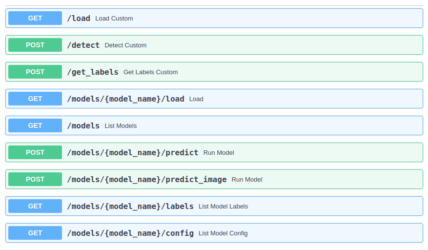

# Inference API Template

The Inference API Template section helps you integrate your code inside a predefined inference template.

*PLEASE REMOVE THIS SECTION AFTER COMPLETING THE FOLLOWING GUIDELINES:*

* In the docker directory, you can find templates for both dockerfile and requirements.txt files
* In the models directory, you can find a template model
* This API template can help you integrate multiple implementations for a similar computer vision framework, or multiple frameworks. All you need to do is the following:
  * Install all dependencies in your docker image
  * create a python file/files similar to framework_type.py template file under src/main/inference. You can find all guidelines in the template file to insert your code
  * In the config.json file inside the model file, the inference_engine_name field should have as value the name of the created file
  * The ConfigurationSchema.json file under src/main/inference, should have the same fields as the config.json file. Any added field in the config.json file should also be added in the ConfigurationSchema.json file
* Complete the below sections by replacing the words inside the curly brackets by the necessary words. Replace the needed GIFs by a GIF like the one found in docs directory
* predict image endpoint should not be taken into consideration when using Image Classification


# {Framework} {CPU|GPU} Inference API For {Windows|Linux}

This is a repository for an {object detection|image classification|image segmentation} inference API using the {Framework} framework.

This repo is based on {repo_link}

The {Framework} version used is {version}. The inference REST API works on {CPU|GPU}. It's supported on {Windows|Linux} Operating systems.

Models trained using our training {framework} repository can be deployed in this API. Several object detection models can be loaded and used at the same time.

**swagger detection|classification|segmentation workflow needed as GIF**

## Prerequisites

- OS:
  - {OS}
- Docker

### Check for prerequisites

To check if you have docker-ce installed:

```sh
docker --version
```

### Install prerequisites

#### {Ubuntu}

Use the following command to install docker on Ubuntu:

```sh
chmod +x install_prerequisites.sh && source install_prerequisites.sh
```

#### {Windows 10}

To [install Docker on Windows](https://docs.docker.com/docker-for-windows/install/), please follow the link.

**P.S: For Windows users, open the Docker Desktop menu by clicking the Docker Icon in the Notifications area. Select Settings, and then Advanced tab to adjust the resources available to Docker Engine.**

## Build The Docker Image

In order to build the project run the following command from the project's root directory:    

```sh
sudo docker build -t {tag_name} -f docker/dockerfile .
```

### Behind a proxy

```sh
sudo docker build --build-arg http_proxy='' --build-arg https_proxy='' -t {tag_name} -f ./docker/dockerfile .
```

## Run the docker container

To run the API, go the to the API's directory and run the following:

#### {Using Linux based docker:}

```sh
sudo docker run -itv $(pwd)/models:/models -v $(pwd)/src/main:/main -p <docker_host_port>:4343 tensorflow_inference_api_cpu
```

#### {Using Windows based docker:}

```sh
docker run -itv ${PWD}/models:/models -v ${pwd}/src/main:/main -p <docker_host_port>:<internal_port> {tag_name}
```

The <docker_host_port>  can be any unique port of your choice.

The API file will be run automatically, and the service will listen to http requests on the chosen port.

## API Endpoints

To see all available endpoints, open your favorite browser and navigate to:

```
http://<machine_IP>:<docker_host_port>/docs
```
The 'predict_batch' endpoint is not shown on swagger. The list of files input is not yet supported.

**P.S: If you are using custom endpoints like /load, /detect, and /get_labels, you should always use the /load endpoint first and then use /detect or /get_labels**

### Endpoints summary

#### /load (GET)

Loads all available models and returns every model with it's hashed value. Loaded models are stored and aren't loaded again

#### /detect (POST)

Performs inference on specified model, image, and returns bounding-boxes

#### /get_labels (POST)

Returns all of the specified model labels with their hashed values

#### /models (GET)

Lists all available models

#### /models/{model_name}/load (GET)

Loads the specified model. Loaded models are stored and aren't loaded again

#### /models/{model_name}/predict (POST)

Performs inference on specified model, image, and returns bounding boxes.

#### /models/{model_name}/predict_image (POST)

Performs inference on specified model, image, draws bounding boxes on the image, and returns the actual image as response

#### /models/{model_name}/labels (GET)

Returns all of the specified model labels

#### /models/{model_name}/config (GET)

Returns the specified model's configuration

#### /models/{model_name}/predict_batch (POST)

Performs inference on specified model and a list of images, and returns bounding boxes



## Usage

Once you have finished training, you need to add the model to the models directory, and then use the following endpoints:

### Load

This process loads the model

**swagger detection|classification|segmentation load endpoint process needed as GIF**

### Get labels

This process shows the model's labels

**swagger detection|classification|segmentation get labels endpoint process needed as GIF**

### Detect

This process returns bounding boxes of the specified model

**swagger detection|classification|segmentation detect endpoint process needed as GIF**

### Predict image

This process shows the predicted image

**swagger detection|classification|segmentation predict image endpoint process needed as GIF**

## Model structure

The folder "models" contains subfolders of all the models to be loaded.
Inside each subfolder there should be a:

- weights file: contains the model weights

- labels file: contains model classes

- {any additional required file: what it contains}

- Config.json (This is a json file containing information about the model)

  ```json
    {
        "inference_engine_name": "tensorflow_detection",
        "confidence": <between_0_and_100>,
        "predictions": <positive_number>,
        "framework": "{framework}",
        "type": "{type}",
        "network": "{network}",
        "{additional_required_fields}": "{if_exists}"
    }
  ```
    P.S:
    - You can change confidence and predictions values while running the API
    - The API will return a response with a confidence higher than the "confidence" value. A high "confidence" can show you only accurate predictions
    - The "predictions" value specifies the maximum number of bounding boxes in the API response
  

## Benchmarking

**example benchmark table**

<table>
    <thead align="center">
        <tr>
            <th></th>
            <th>{OS}</th>
            <th colspan=3>{OS}</th>
        </tr>
    </thead>
    <thead align="center">
        <tr>
            <th>Network\Hardware</th>
            <th>{hardware}</th>
            <th>{hardware}</th>
            <th>{hardware}</th>
            <th>{hardware}</th>
        </tr>
    </thead>
    <tbody align="center">
        <tr>
            <td>{network}</td>
            <td>0.000 seconds/image</td>
            <td>0.000 seconds/image</td>
            <td>0.000 seconds/image</td>
            <td>0.000 seconds/image</td>
        </tr>
        <tr>
            <td>{network}</td>
            <td>0.000 seconds/image</td>
            <td>0.000 seconds/image</td>
            <td>0.000 seconds/image</td>
            <td>0.000 seconds/image</td>
        </tr>
        <tr>
            <td>{network}</td>
            <td>0.000 seconds/image</td>
            <td>0.000 seconds/image</td>
            <td>0.000 seconds/image</td>
            <td>0.000 seconds/image</td>
        </tr>
        <tr>
            <td>{network}</td>
            <td>0.000 seconds/image</td>
            <td>0.000 seconds/image</td>
            <td>0.000 seconds/image</td>
            <td>0.000 seconds/image</td>
        </tr>
        <tr>
            <td>{network}</td>
            <td>0.000 seconds/image</td>
            <td>0.000 seconds/image</td>
            <td>0.000 seconds/image</td>
            <td>0.000 seconds/image</td>
        </tr>
        <tr>
            <td>{network}</td>
            <td>0.000 seconds/image</td>
            <td>0.000 seconds/image</td>
            <td>0.000 seconds/image</td>
            <td>0.000 seconds/image</td>
        </tr>
    </tbody>
</table>

